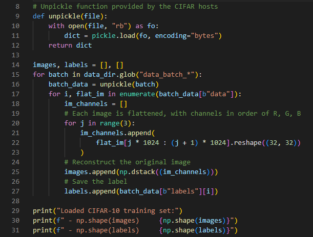
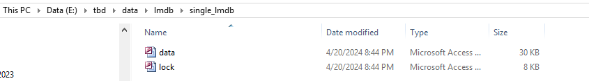
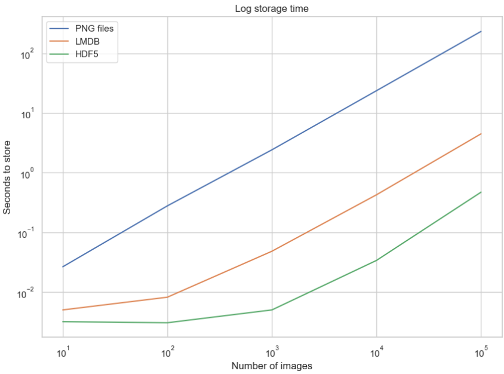

Kanaya Dea Thalita Akhmad
121450001
RB

# **Three Ways of Storing and Accessing Lots of Images in Python**

# SETUP 
## A Dataset to Play With 
Kita bakal pakai dataset gambar CIFAR-10 (Canadian Institute for Advanced Research). Dataset ini berisi 60.000 gambar berwarna ukuran 32x32 piksel yang terbagi ke dalam 10 kategori objek, seperti anjing, kucing, dan pesawat. Dalam format Python, ukuran dataset ini 163 MB.

Folder yang diunduh itu nggak berisi gambar biasa yang bisa dibaca manusia. Gambar-gambarnya udah diserialisasi dan disimpan dalam batch pake cPickle. Nah, kode di bawah ini ngambil kelima file batch itu, terus ngeload semua gambarnya jadi array  
lakukan unzip terlebih dahulu dari dataset yang udah kita download tadi dan copy pathnya kesini 

load datanya : 

Semua gambar dari dataset CIFAR-10 itu sekarang udah dimuat ke dalam variabel images dalam bentuk array NumPy. Metadata atau label-nya juga tersedia di variabel labels. Dengan begitu, gambar-gambar tersebut siap untuk dimanipulasi atau diproses lebih lanjut.

menghasilkan output seperti diatas, yang artinya 
'np.shape(images)': Ini menunjukkan dimensi dari array yang berisi gambar-gambar CIFAR-10. Dalam hal ini, (50000, 32, 32, 3) mengindikasikan bahwa terdapat 50000 gambar, masing-masing berukuran 32x32 piksel, dan memiliki 3 saluran warna (RGB).
'np.shape(labels)': Ini menunjukkan dimensi dari array yang berisi label-label yang sesuai dengan setiap gambar CIFAR-10. (50000,) mengindikasikan bahwa terdapat 50000 label yang sesuai dengan 50000 gambar dalam dataset.
## Setup for Storing Images on Disk
Kita harus menyiapkan lingkungan komputer terlebih dahulu untuk memuat dan mengakses gambar-gambar ini dari disk. Artikel ini mengasumsikan kita sudah menginstal Python 3.x di sistem, dan akan menggunakan library Pillow untuk memanipulasi gambar-gambarnya. 

Sekarang kita siap untuk menyimpan dan membaca gambar dari disk.
## Getting Started With LMDB
LMDB, terkadang disebut sebagai “Lightning Database,” adalah singkatan dari Lightning Memory-Mapped Database karena cepat dan menggunakan file yang dipetakan memori, adapun point ciri dari LMDB : 
1. LMDB (Lightning Memory-Mapped Database) adalah penyimpanan nilai kunci yang cepat dan menggunakan file yang dipetakan ke memori.
2. LMDB menggunakan struktur data pohon B+, yang mirip dengan struktur pohon dengan simpul yang saling terhubung untuk traversal yang cepat.
3. Simpul pada pohon B+ diatur sesuai dengan ukuran halaman sistem operasi host untuk memaksimalkan efisiensi akses.
4. Kinerja tinggi LMDB bergantung pada sistem file yang mendasarinya dan implementasinya.
5. LMDB dipetakan ke memori, sehingga memberikan akses langsung ke alamat memori tanpa perlu menyalin data.
6. Untuk menggunakan LMDB di Python, pengikatan Python untuk perpustakaan LMDB C dapat diinstal melalui pip.
untuk menggunakan pengikatan Python untuk perpustakaan LMDB C, yang dapat diinstal melalui pip:

## Getting Started With HDF5
HDF5 adalah singkatan dari Hierarchical Data Format, merupakan format file yang dipertahankan saat ini (versi terbaru dari HDF4). adapun beberapa point penting format ini : 
1. HDF berasal dari National Center for Supercomputing Applications, dirancang sebagai format data ilmiah yang portabel dan ringkas.
2. File HDF terdiri dari dua jenis objek: kumpulan data (dataset) dan grup.
3. Kumpulan data adalah array multidimensi dengan ukuran dan tipe yang seragam dalam satu kumpulan data.
4. Grup adalah kumpulan dari kumpulan data atau grup lain, sehingga memungkinkan struktur data yang heterogen.
5. Kumpulan data harus berisi array berdimensi N yang homogen, tetapi dengan mengandalkan struktur grup dan kumpulan data yang disarangkan, heterogenitas data dapat dicapai.
nah kita lakukan install dulu : 

# Storing a Single Image
Sekarang liat perbandingan waktu baca-tulis file sama pemakaian memori disknya. Ini juga sekalian ngasih gambaran gimana cara kerjanya pake contoh kode.
Saat bilang "file", maksudnya ya banyak file. Tapi penting dibedain, soalnya metode-metodenya mungkin dioptimalin buat operasi dan jumlah file yang beda-beda.
Buat eksperimennya, kita bisa bandingin kinerja dari jumlah file yang bervariasi, mulai dari 1 gambar sampe 100.000 gambar dengan kelipatan 10. Karena dataset CIFAR-10 kita ada 50.000 gambar, kita bisa pake masing-masing gambar dua kali jadi 100.000.
Untuk persiapan, kita perlu bikin folder buat masing-masing metode, yang nanti bakal isi file-file atau gambar databasenya. Terus simpan path ke folder-folder itu di variabel:

## Storing to Disk
Jadi, bahan eksperimennya itu satu gambar yang udah dalam bentuk array NumPy di memori. Nah, sekarang tugas kita adalah nyimpen gambar itu ke disk dalam format .png, dengan nama file pake ID unik image_id.
Cara mudahnya begini pake library Pillow yang udah diinstal:

tersimpam dalam 
 
dan jika kita lihat dalam folder penyimpan tujuan akan muncul output berikut 

Itu cara buat nyimpen gambarnya aja. Nah, di aplikasi beneran, pasti kita juga butuh nyimpen metadata kayak label gambarnya. Waktu nyimpen gambar ke disk, ada beberapa pilihan buat nyimpen metadata ini.
Salah satu caranya adalah kodekan label langsung ke nama filenya. Kelebihannya gak perlu bikin file tambahan lagi.
Tapi kelemahannya juga lumayan besar, karena setiap kali mau edit label, kita harus liat semua file dulu. Akan lebih baik simpen label di file terpisah, biar bisa diacak-acak sendiri tanpa harus buka gambarnya.
Nah, contoh di atas udah nyimpen labelnya di file .csv tersendiri buat eksperimen ini.
Tinggal lakuin hal yang sama persis pake LMDBnya nih
## Storing to LMDB
Jadi LMDB itu sistemnya penyimpanan nilai-kunci, dimana setiap entri disimpen dalam bentuk byte array. Dalam kasus kita, kuncinya bakal jadi ID unik buat setiap gambar, dan nilainya ya gambarnya itu sendiri. Baik kunci maupun nilainya harus berupa string, jadi cara umumnya kita serialize dulu nilai tersebut jadi string, terus deserialize lagi waktu membacanya nanti.
Buat serialize ini, bisa pake library pickle. Objek Python apa aja bisa diserialize, jadi sebaiknya kita tambahin juga metadata gambarnya ke dalam database. Gitu biar nggak repot nyatuin metadata sama gambarnya nanti pas baca dari disk.
lalu buat dulu kelas Python buat nampung gambar sama metadatanya:

Oke lanjut, untuk poin kedua. Karena LMDB ini dipetakan ke memori, jadi kita harus ngasih tau dulu perkiraan memori yang bakal dipake buat databasenya. Ini relatif gampang di kasus kita, tapi bisa jadi masalah besar di kasus lain nanti. Variabel ini disebut map_size di LMDB.
Terus yang terakhir, operasi baca-tulis di LMDB dilakuin dalam bentuk transaksi. Bisa dianggap mirip kayak database tradisional, yang isinya sekumpulan operasi di database. Ini mungkin keliatan lebih ribet dari versi disk, tapi tunggu dulu jangan terburu buru, baca dulu!
Nah, dengan ingat tiga poin tadi, ini kodenya buat nyimpen satu gambar ke LMDB:

maka akan menghasilkan output sebagai berikut : 

pertama kita bikin environment LMDB dengan map_size 1GB. Terus kita mulai transaksi tulis, buat objek ImageMeta, serialize jadi string. Terus tinggal panggil txn.put() buat nyimpen dengan kunci 'image_0'. Selesei deh, semua perubahan ke LMDB akan di-commit otomatis di akhir transaksi.
## Storing With HDF5
Ingatlah bahwa file HDF5 dapat berisi lebih dari satu kumpulan data. Dalam kasus yang agak sepele ini, Kita dapat membuat dua himpunan data, satu untuk gambar, dan satu lagi untuk meta datanya:

outputnya kan tersimpan seperti ini : 

## Experiments for Storing a Single Image
Sekarang kita bisa memasukkan ketiga fungsi untuk menyimpan satu gambar ke dalam kamus, yang dapat dipanggil nanti selama eksperimen pengaturan waktu, yang mana nantinya kan membandingkan Hasil waktu eksekusi untuk setiap metode penyimpanan mana yang paling cepat 

metode dengan lmbd terlihat hasil eksekusinya lebih cepat dibanding yang lainnya 
# Storing Many Images
Setelah kita coba yang single image, nah kita mulai coba yang many images. siapkan memori internal kalian huhu
## Adjusting the Code for Many Images
Buat nyimpen banyak gambar dalam format .png, tinggal panggil fungsi store_single_method() berulang-ulang aja gampang. Tapi hal ini nggak berlaku buat LMDB atau HDF5, karena kita nggak mau bikin file database beda-beda buat setiap gambarnya. Sebaliknya, kita mau naruh semua gambar dalam satu atau lebih file aja.
Jadi kita perlu sedikit modifikasi kodenya dulu, bikin tiga fungsi baru yang bisa nerima banyak gambar sekaligus, yaitu store_many_disk(), store_many_lmdb(), dan store_many_hdf5():
``` 
_store_many_funcs = dict(
    disk=store_many_disk, lmdb=store_many_lmdb, hdf5=store_many_hdf5
)

from timeit import timeit

store_many_timings = {"disk": [], "lmdb": [], "hdf5": []}

for cutoff in cutoffs:
    for method in ("disk", "lmdb", "hdf5"):
        t = timeit(
            "_store_many_funcs[method](images_, labels_)",
            setup="images_=images[:cutoff]; labels_=labels[:cutoff]",
            number=1,
            globals=globals(),
        )
        store_many_timings[method].append(t)

        # Print out the method, cutoff, and elapsed time
        print(f"Method: {method}, Time usage: {t}") 
```

### Mempersiapkan Dataset

Dari dataset yang tersedia, kita lakukan pilih saja yang tersedia, nah disini disiapkan dataset sebanyak 1000 gambar

```python
cutoffs = [10, 100, 1000, 10000, 100000]
# Let's double our images so that we have 100,000
images = np.concatenate((images, images), axis=0)
labels = np.concatenate((labels, labels), axis=0)
# Make sure you actually have 100,000 images and labels
print(np.shape(images))
print(np.shape(labels))
```
::: {.output .stream .stdout}
    (100000, 32, 32, 3)
    (100000,)


## Eksperimen Storing Many Images
Proses berikutnya melibatkan iterasi melalui serangkaian nilai ambang batas dan tiga metode penyimpanan. Untuk setiap kombinasi nilai ambang batas dan metode penyimpanan, waktu eksekusi diukur dengan memanggil fungsi penyimpanan dan hasilnya dicatat dalam sebuah dictionary. Langkah ini bertujuan untuk mengevaluasi kinerja metode penyimpanan dengan berbagai nilai ambang batas.

dengan menggunakan fungsi timeit untuk menentukan durasi waktu yang dibutuhkan dalam memanggil fungsi penyimpanan tersebut dengan parameter yang sesuai. Hasil pengukuran waktu eksekusi kemudian dicatat ke dalam sebuah dictionary bernama store_many_timings.


```python
_store_many_funcs = dict(
    disk=store_many_disk, lmdb=store_many_lmdb, hdf5=store_many_hdf5
)
from timeit import timeit
store_many_timings = {"disk": [], "lmdb": [], "hdf5": []}
for cutoff in cutoffs:
    for method in ("disk", "lmdb", "hdf5"):
        t = timeit(
            "_store_many_funcs[method](images_, labels_)",
            setup="images_=images[:cutoff]; labels_=labels[:cutoff]",
            number=1,
            globals=globals(),
        )
        store_many_timings[method].append(t)
        # Print out the method, cutoff, and elapsed time
        print(f"Method: {method}, Time usage: {t}")
```

untuk gambar ini menyatakan waktu penyimpanan yang normal, tanpa penyesuaian, menyoroti perbedaan drastis antara menyimpan ke file .png dan ke LMDB atau HDF5.

gambar kedua merupakan log dari waktu yang diukur, menyoroti bahwa HDF5 mulai lebih lambat dari LMDB tetapi, dengan jumlah gambar yang lebih besar, akhirnya sedikit lebih baik



## **Reading a Single Image**

### Membaca dari Disk

Kode ini mendefinisikan fungsi read_single_disk yang membaca dan memuat sebuah gambar beserta labelnya dari disk. Fungsi ini menerima image_id sebagai parameter untuk mengidentifikasi gambar yang akan dimuat. Gambar dibaca dari file PNG menggunakan library PIL, sedangkan labelnya dibaca dari file CSV yang sesuai. Fungsi ini mengembalikan gambar sebagai array NumPy dan label terkait sebagai bilangan bulat.
```python
def read_single_disk(image_id):
    """ Stores a single image to disk.
        Parameters:
        ---------------
        image_id    integer unique ID for image
        Returns:
        ----------
        image       image array, (32, 32, 3) to be stored
        label       associated meta data, int label
    """
    image = np.array(Image.open(disk_dir / f"{image_id}.png"))
    with open(disk_dir / f"{image_id}.csv", "r") as csvfile:
        reader = csv.reader(
            csvfile, delimiter=" ", quotechar="|", quoting=csv.QUOTE_MINIMAL
        )
        label = int(next(reader)[0])
    return image, label
```


### Membaca dari LMDB
Kode ini mendefinisikan fungsi read_single_lmdb yang membaca dan memuat sebuah gambar beserta labelnya dari database LMDB (Lightning Memory-Mapped Database). Fungsi ini menerima image_id sebagai parameter untuk mengidentifikasi gambar yang akan dimuat. Pertama, fungsi membuka lingkungan LMDB dalam mode read-only. Kemudian, kode memulai transaksi baca baru dan mendapatkan data gambar yang disimpan sebelumnya menggunakan image_id sebagai kunci. Data yang diperoleh merupakan objek CIFAR_Image yang di-pickle, sehingga perlu di-unpickle terlebih dahulu untuk mendapatkan gambar dan labelnya. Akhirnya, fungsi mengembalikan gambar sebagai array NumPy dan label terkait sebagai bilangan bulat.
```python
def read_single_lmdb(image_id):
    """ Stores a single image to LMDB.
        Parameters:
        ---------------
        image_id    integer unique ID for image
        Returns:
        ----------
        image       image array, (32, 32, 3) to be stored
        label       associated meta data, int label
    """
    # Open the LMDB environment
    env = lmdb.open(str(lmdb_dir / f"single_lmdb"), readonly=True)
    # Start a new read transaction
    with env.begin() as txn:
        # Encode the key the same way as we stored it
        data = txn.get(f"{image_id:08}".encode("ascii"))
        # Remember it's a CIFAR_Image object that is loaded
        cifar_image = pickle.loads(data)
        # Retrieve the relevant bits
        image = cifar_image.get_image()
        label = cifar_image.label
    env.close()
    return image, label
```


##### Membaca dari HDF5

Kode ini mendefinisikan fungsi read_single_hdf5 yang membaca dan memuat sebuah gambar beserta labelnya dari file HDF5 (Hierarchical Data Format 5). Fungsi ini menerima image_id sebagai parameter untuk mengidentifikasi file HDF5 yang akan dibuka. Pertama, fungsi membuka file HDF5 yang sesuai dalam mode read-write. Kemudian, gambar dibaca dari dataset "/image" dalam file HDF5 dan dikonversi menjadi array NumPy dengan tipe data uint8. Label dibaca dari dataset "/meta", dikonversi menjadi array NumPy, lalu diubah menjadi bilangan bulat. Akhirnya, fungsi mengembalikan gambar dan label yang telah dibaca.
```python
def read_single_hdf5(image_id):
    """ Stores a single image to HDF5.
        Parameters:
        ---------------
        image_id    integer unique ID for image
        Returns:
        ----------
        image       image array, (32, 32, 3) to be stored
        label       associated meta data, int label
    """
    # Open the HDF5 file
    file = h5py.File(hdf5_dir / f"{image_id}.h5", "r+")
    image = np.array(file["/image"]).astype("uint8")
    label = int(np.array(file["/meta"]).astype("uint8"))
    return image, label
```

Buka file HDF5.
Akses dataset images untuk mendapatkan gambar, dan dataset labels untuk metadata, menggunakan indeks gambar (image_index).

```python
_read_single_funcs = dict(
    disk=read_single_disk, lmdb=read_single_lmdb, hdf5=read_single_hdf5
)
```


### Eksperimen Reading a Single Image

Pengaturan Eksperimen
Eksperimen ini melibatkan kode yang digunakan untuk memuat sebuah gambar beserta metadata terkait menggunakan tiga pendekatan yang berbeda.
Metode yang Digunakan

1. Disk: Membaca data gambar dan metadata secara langsung dari file yang tersimpan di disk penyimpanan.
2. LMDB: Memanfaatkan database LMDB (Lightning Memory-Mapped Database) untuk menyimpan dan mengakses data gambar serta metadata.
3. HDF5: Menggunakan format data HDF5 (Hierarchical Data Format 5) untuk menyimpan dan memuat data gambar dan metadata terkait.

```python
from timeit import timeit
read_single_timings = dict()
for method in ("disk", "lmdb", "hdf5"):
    t = timeit(
        "_read_single_funcs[method](0)",
        setup="image=images[0]; label=labels[0]",
        number=1,
        globals=globals(),
    )
    read_single_timings[method] = t
    print(f"Method: {method}, Time usage: {t}")
```

Hasil eksperiment : 
Method: disk, Time usage: 0.01848480000080599
Method: 1mdb, Time usage: 0.017495100000815
Method: hdf5, Time usage: 0.01604079999924579

maka 
1. Metode penyimpanan dan pembacaan data menggunakan disk memiliki waktu eksekusi yang sedikit lebih lama dibandingkan dengan metode LMDB dan HDF5.
2. Metode HDF5 memiliki waktu eksekusi tercepat di antara ketiga metode yang diuji, dengan waktu 0.01604079999924579.
3. Metode LMDB memiliki waktu eksekusi di antara metode disk dan HDF5, dengan waktu 0.017495100000815.

Meskipun perbedaan waktu eksekusi antara ketiga metode relatif kecil, hasil ini menunjukkan bahwa metode HDF5 sedikit lebih unggul dalam hal kinerja pembacaan data gambar dan metadata dibandingkan dengan metode disk dan LMDB pada eksperimen ini.

#### **Reading Many Images**

### Menyesuaikan Kode Untuk Many Images

Perluasan Fungsi Pembacaan
1. Fungsi pembacaan yang sudah ada akan diperluas dengan menambahkan varian baru, yaitu read_many_. 2. Varian ini memungkinkan pembacaan sejumlah gambar sekaligus dalam satu kali panggilan fungsi.
3. Fungsi read_many_ ini akan digunakan dalam eksperimen berikutnya untuk mengevaluasi performa masing-masing metode penyimpanan saat membaca jumlah gambar yang bervariasi.


Penyimpanan Fungsi dalam Dictionary

Fungsi-fungsi pembacaan yang telah diperluas, termasuk varian baru read_many_, akan disimpan dalam struktur data dictionary.

```python
def read_many_disk(num_images):
    """ Reads image from disk.
        Parameters:
        ---------------
        num_images   number of images to read
        Returns:
        ----------
        images      images array, (N, 32, 32, 3) to be stored
        labels      associated meta data, int label (N, 1)
    """
    images, labels = [], []
    # Loop over all IDs and read each image in one by one
    for image_id in range(num_images):
        images.append(np.array(Image.open(disk_dir / f"{image_id}.png")))
    with open(disk_dir / f"{num_images}.csv", "r") as csvfile:
        reader = csv.reader(
            csvfile, delimiter=" ", quotechar="|", quoting=csv.QUOTE_MINIMAL
        )
        for row in reader:
            labels.append(int(row[0]))
    return images, labels
def read_many_lmdb(num_images):
    """ Reads image from LMDB.
        Parameters:
        ---------------
        num_images   number of images to read
        Returns:
        ----------
        images      images array, (N, 32, 32, 3) to be stored
        labels      associated meta data, int label (N, 1)
    """
    images, labels = [], []
    env = lmdb.open(str(lmdb_dir / f"{num_images}_lmdb"), readonly=True)
    # Start a new read transaction
    with env.begin() as txn:
        # Read all images in one single transaction, with one lock
        # We could split this up into multiple transactions if needed
        for image_id in range(num_images):
            data = txn.get(f"{image_id:08}".encode("ascii"))
            # Remember that it's a CIFAR_Image object
            # that is stored as the value
            cifar_image = pickle.loads(data)
            # Retrieve the relevant bits
            images.append(cifar_image.get_image())
            labels.append(cifar_image.label)
    env.close()
    return images, labels
def read_many_hdf5(num_images):
    """ Reads image from HDF5.
        Parameters:
        ---------------
        num_images   number of images to read
        Returns:
        ----------
        images      images array, (N, 32, 32, 3) to be stored
        labels      associated meta data, int label (N, 1)
    """
    images, labels = [], []
    # Open the HDF5 file
    file = h5py.File(hdf5_dir / f"{num_images}_many.h5", "r+")
    images = np.array(file["/images"]).astype("uint8")
    labels = np.array(file["/meta"]).astype("uint8")
    return images, labels
_read_many_funcs = dict(
    disk=read_many_disk, lmdb=read_many_lmdb, hdf5=read_many_hdf5
)
```

##### Eksperimen Reading Many Images

Dalam kode implementasi ini, dilakukan pengukuran waktu untuk membaca sejumlah gambar dari tiga metode penyimpanan yang berbeda: disk, lmdb, dan hdf5 namun dalam jumlah data yang cukup banyak

```python
from timeit import timeit
read_many_timings = {"disk": [], "lmdb": [], "hdf5": []}
for cutoff in cutoffs:
    for method in ("disk", "lmdb", "hdf5"):
        t = timeit(
            "_read_many_funcs[method](num_images)",
            setup="num_images=cutoff",
            number=1,
            globals=globals(),
        )
        read_many_timings[method].append(t)
        # Print out the method, cutoff, and elapsed time
        print(f"Method: {method}, No. images: {cutoff}, Time usage: {t}")
```

::: {.output .stream .stdout}
    Method: disk, No.
images: 10, Time usage: 5.000001692678779e-07
Method: lmdb, No. images: 10, Time usage: 7.00001692166552e-07
Method: hdf5, No.
images: 10, Time usage: 6.000009307172149e-07
Method: disk, No. images: 100, Time usage: 8.000006346264854e-07
Method: lmdb, No. images: 100, Time usage: 5.000001692678779e-07
Method: hdf5, No. images: 100, Time usage: 5.000001692678779e-07
Method: disk, No. images: 1000, Time usage: 3.9999940781854093e-07
Method: Imdb, No. images: 1000, Time usage: 4.000012268079445e-07
Method: hdf5, No. images: 1000, Time usage: 5.000001692678779e-07
Method: disk, No. images: 10000, Time usage: 3.9999940781854093e-07
Method: lmdb, No. images: 10000, Time usage: 4.000012268079445e-07
Method: hdf5, No. images: 10000, Time usage: 2.999986463692039e-07
Method: disk, No. images: 100000, Time usage: 2.999986463692039e-07
Method: Imdb, No. images: 100000, Time usage: 4.000012268079445e-07
Method: hdf5, No. images: 100000, Time usage: 3.9999940781854093e-07


dari kedua gambar tersebut Meskipun memulai dari posisi yang lebih lambat, metode HDF5 menunjukkan peningkatan performa yang signifikan seiring dengan bertambahnya jumlah gambar yang dibaca. Hal ini mengindikasikan bahwa HDF5 mungkin lebih efisien dalam skenario pembacaan batch gambar yang lebih besar.

Grafik logaritma waktu pembacaan menegaskan bahwa ketika jumlah gambar yang dibaca sedikit, perbedaan performa antara metode-metode penyimpanan tidak terlalu jelas. Namun, perbedaan ini menjadi lebih nyata ketika jumlah gambar yang dibaca semakin banyak.

### **Considering Disk Usage**


#### **Kesimpulan**

Artikel ini mengeksplorasi tiga pendekatan untuk menyimpan dan mengakses gambar menggunakan Python: penyimpanan gambar dalam format .png di disk, penggunaan database LMDB, dan penggunaan format HDF5. Meskipun menyimpan gambar sebagai file .png merupakan metode yang mudah dipahami, pendekatan seperti HDF5 atau LMDB menawarkan peningkatan kinerja yang signifikan. Namun, tidak ada metode penyimpanan yang sempurna, sehingga pemilihan harus disesuaikan dengan karakteristik dataset dan kebutuhan kasus penggunaan spesifik. Evaluasi performa mengungkapkan perbedaan dalam penggunaan ruang disk dan efisiensi, dengan LMDB dan HDF5 memberikan keunggulan tertentu bergantung pada skenario penggunaan dan ukuran data.
